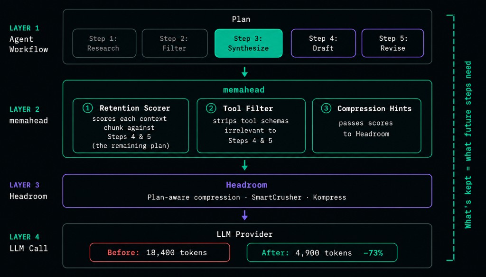

# memahead

**Agent memory, optimized for what's ahead.**

Compress what your agent remembers based on where it's going —
not just where it's been.



## Results

Real numbers from the benchmark suite — run them yourself:

| Workflow | Before | After | Saved |
|----------|--------|-------|-------|
| Research & Synthesis | 6,240 tokens | 4,795 tokens | 23% |
| Code Review | 5,386 tokens | 2,113 tokens | 61% |
| Data Analysis | 4,821 tokens | 494 tokens | **90%** |

100% critical fact retention across all workflows.  
Plan-aware compression outperforms Headroom-only by up to **87%** on data-heavy workflows.

→ [Full benchmark methodology and comparison](benchmarks/results/README.md)  
→ Reproduce: `python -m benchmarks.run_benchmark`

[](https://pypi.org/project/memahead/)
[](https://github.com/memahead/memahead/blob/main/LICENSE)
[](https://github.com/memahead/memahead/actions)

memahead compresses an LLM agent's context at *each step* of a multi-step
workflow using forward-looking, plan-aware retention. Unlike tools that
compress greedily based on what already happened, memahead scores every chunk
of context against the **remaining steps in the plan** and drops what future
steps won't need — dramatically fewer tokens per agent call, without losing the
information that matters downstream.

memahead sits on top of [Headroom](https://pypi.org/project/headroom-ai/)
(`pip install headroom-ai`), which performs the underlying compression
mechanics. memahead adds the plan-aware retention scoring layer.

## Install

```bash
pip install memahead
```

This pulls in `headroom-ai`, `sentence-transformers`, and `numpy`. For more
accurate token accounting, also install the optional extra:

```bash
pip install "memahead[tokenizers]"   # adds tiktoken
```

## Quick example

```python
from memahead import Plan, Step, PlanAwareCompressor

plan = Plan([
    Step("research", "Search and gather raw facts about the topic"),
    Step("synthesize", "Identify key themes across the research"),
    Step("draft", "Write a structured first draft"),
    Step("revise", "Produce the final polished output"),
])

compressor = PlanAwareCompressor(quality=0.85)

compressed = compressor.compress(
    history=prior_messages,      # your prior chat messages
    tools=all_tool_schemas,      # the full tool catalog
    plan=plan,
    current_step="synthesize",   # the step about to run
)

response = llm.call(
    messages=compressed.messages,
    tools=compressed.tools,
)

print(compressed.report)
# TokenReport(before=12400, after=3100, saved=9300, compression_ratio=0.75)
```

## Budget-constrained compression

By default memahead compresses based on the `quality` threshold alone.
For precise cost control — or when you need to respect a hard context
window limit — set `budget_tokens`:

```python
from memahead import PlanAwareCompressor, BudgetExceededError

compressor = PlanAwareCompressor(
    quality=0.85,
    budget_tokens=2000,  # never exceed 2000 tokens output
)

compressed = compressor.compress(
    history=prior_messages,
    tools=all_tool_schemas,
    plan=plan,
    current_step="synthesize",
)

print(compressed.report)
# TokenReport(..., budget=2000, utilization=99.4%, dropped_for_budget=3)
```

When `budget_tokens` is set, memahead enforces the ceiling by dropping
the lowest-relevance chunks first — always protecting system messages,
the current turn, and any chunk scoring above your `quality` threshold.

If the budget is impossible to meet while protecting critical context,
`BudgetExceededError` tells you the minimum achievable token count so
you can adjust.

> Inspired by [ContextBudget](https://arxiv.org/abs/2604.01664) (2026),
> which showed that budget-free compression causes two failure modes:
> over-compression that loses critical evidence, and under-compression
> that overflows context limits.

## How it works

For the step about to run, memahead:

1. **Splits** the conversation history into chunks (one per message).
2. **Scores** each chunk against the *remaining* plan steps with a
   `RetentionScorer` — embedding both with `all-MiniLM-L6-v2` and taking the
   cosine similarity. A chunk is valuable if a future step is likely to need it.
3. **Drops** chunks that future steps won't need (system messages and the
   current turn's input are always retained).
4. **Filters** the tool catalog down to schemas relevant to the current step —
   deterministically, with no extra LLM call (`tool_filter`).
5. **Hands** the survivors to Headroom for the actual mechanical compression.
6. **Returns** a `CompressedContext` with lean `messages`, filtered `tools`,
   and a `TokenReport` of exactly what was saved.

The `quality` dial (0.0–1.0) trades tokens for retention: higher keeps more
context, lower compresses more aggressively. Pass an explicit
`retention_threshold` for fully reproducible runs.

## Public API

| Symbol | Purpose |
| --- | --- |
| `Step`, `Plan`, `PlanGraph` | Model linear or branching workflows; `plan.remaining_from(step)` is the forward horizon. |
| `RetentionScorer` | Forward-looking chunk scoring (the core novelty). |
| `ToolFilter`, `filter_tools` | Deterministic, LLM-free tool-schema filtering. |
| `PlanAwareCompressor` | The full pipeline. |
| `CompressedContext`, `TokenReport` | Results and savings accounting. |

The embedding backend is swappable: pass any callable
`list[str] -> np.ndarray` (or an object with `.encode`) as `embedder=` to
`RetentionScorer`, `ToolFilter`, or `PlanAwareCompressor`. This makes memahead
fully testable offline.

## Development

```bash
pip install -e ".[dev]"
pytest
```

## Academic foundations

memahead productizes findings from two papers that did not ship a usable
library. It is an independent implementation and is not affiliated with or
endorsed by the original authors.

- **PAACE** — Yuksel et al., *Plan-Aware Agent Context Engineering*,
  arXiv:[2512.16970](https://arxiv.org/abs/2512.16970) (Dec 2025).
- **ACON** — Kang et al. (Microsoft), *Agent Context Optimization*,
  arXiv:[2510.00615](https://arxiv.org/abs/2510.00615) (2025).

See [`NOTICE`](./NOTICE) for full attribution.

## License

[Apache-2.0](./LICENSE).
